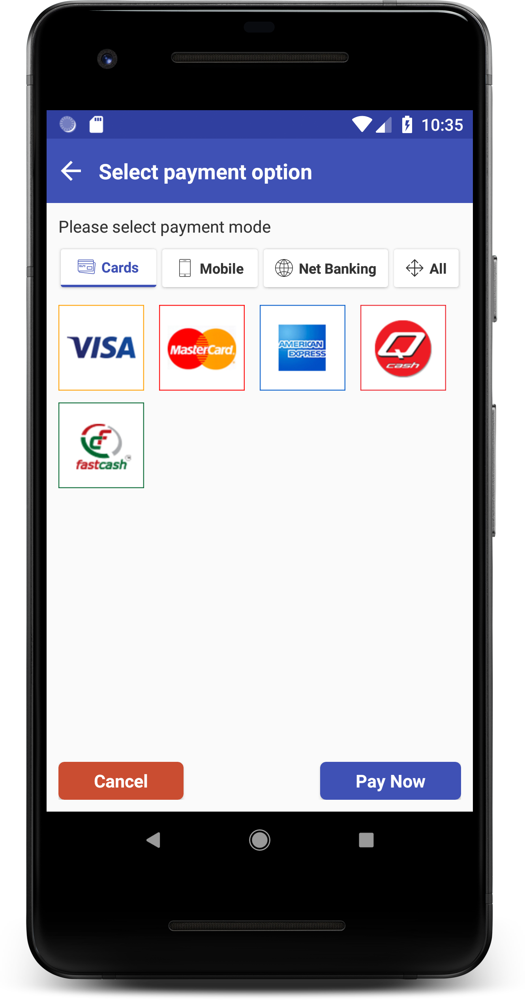

### SSLCommerz Integration For Android Applications.


- Follow few steps to integrate SSLCommerz in your app.


#### Step 1:  
-In your root build.gradle file please add the bellow code.

    allprojects {
    repositories {
      maven { url 'https://jitpack.io' }
        }
    }
	
	#### Step 2:  
  -Add the dependency.


      implementation 'com.github.ssl-zahid:SSLCommerz-Android-Library-:v1.0.2'
  
  For better performance use the latest version.
  
#### Step 3:  
-Add this permission into your manifest.


      <uses-permission android:name="android.permission.INTERNET" />
	  
	  
### Step 4:  
-After successfully completed SDK integration, You can request for transaction. You must have to pass
MandatoryFieldModel to start Transaction. You can also pass CustomerFieldModel, ShippingFieldModel and
AdditionalFieldModel.


      MandatoryFieldModel mandatoryFieldModel = new MandatoryFieldModel("Your store Id", "Your store password", amount, "Your transaction id", CurrencyType.BDT, SdkType.TESTBOX, SdkCategory.BANK_LIST);
            

### Step 5:  
-Now call for the payment


``` java
PayUsingSSLCommerz.getInstance().setData(MainActivity.this, mandatoryFieldModel, new OnPaymentResultListener() {
                @Override
                public void transactionSuccess(TransactionInfo transactionInfo) {
                    // If payment is success and risk label is 0 get payment details from here
                    if (transactionInfo.getRiskLevel().equals("0")) {

                        Log.e(TAG, transactionInfo.getValId());
                       /* After successful transaction send this val id to your server and from
                         your server you can call this api
                         https://sandbox.sslcommerz.com/validator/api/validationserverAPI.php?val_id=yourvalid&store_id=yourstoreid&store_passwd=yourpassword
                         if you call this api from your server side you will get all the details of the transaction.
                         for more details visit:   www.tashfik.me
            */
                    }
// Payment is success but payment is not complete yet. Card on hold now.
                    else {
                        Log.e(TAG, "Transaction in risk. Risk Title : " + transactionInfo.getRiskTitle());
                    }
                }

                @Override
                public void transactionFail(String s) {
                    Log.e(TAG, s);
                }


                @Override
                public void error(int errorCode) {
                    switch (errorCode) {
// Your provides information is not valid.
                        case ErrorKeys.USER_INPUT_ERROR:
                            Log.e(TAG, "User Input Error");
                            break;
// Internet is not connected.
                        case ErrorKeys.INTERNET_CONNECTION_ERROR:
                            Log.e(TAG, "Internet Connection Error");
                            break;
// Server is not giving valid data.
                        case ErrorKeys.DATA_PARSING_ERROR:
                            Log.e(TAG, "Data Parsing Error");
                            break;
// User press back button or canceled the transaction.
                        case ErrorKeys.CANCEL_TRANSACTION_ERROR:
                            Log.e(TAG, "User Cancel The Transaction");
                            break;
// Server is not responding.
                        case ErrorKeys.SERVER_ERROR:
                            Log.e(TAG, "Server Error");
                            break;
// For some reason network is not responding
                        case ErrorKeys.NETWORK_ERROR:
                            Log.e(TAG, "Network Error");
                            break;
                    }
                }
            }); 
```
            
            
            
            
### Error Codes :  


| Type | Attribute | Summery |
| :---         |     :---:      |          :---: |
| Int   | DATA_PARSING_ERROR    | Response data from server is not invalid format.    |
| Int     | INTERNET_CONNECTION_ERROR      | Internet connection error     |
| Int   | USER_INPUT_ERROR    | Passing data is not valid.   |
| Int    | CANCEL_TRANSACTION_ERROR     | User cancel transaction.   |
| Int   | SERVER_ERROR    | Server is not responding.  |
| Int    | NETWORK_ERROR     | Network not working.     | 


 


